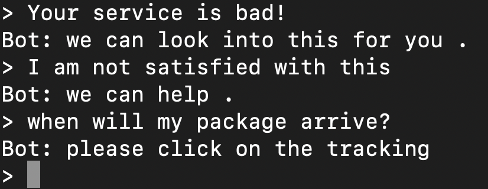

# Lightweight-Language-Models-to-Generate

## Data

Download the [data](https://www.kaggle.com/thoughtvector/customer-support-on-twitter). Use [this script](./data/preprocess.ipynb) to preprocess the data and save the results. 

## Train and Test

Assume we put the preprocessed data in directory [data](./data). 

To train the model:

```shell
python main.py --corpus_path data/index_without_duplicates.csv --vocab_path data/vocab.txt --dropout 0.5 --learning_rate 5e-5 --batch_size 64 --emb_size 128 --hidden_size 256 --use_cuda --n_epoch 30 --model_name gru_seq2seq --save_dir saved_models
```

the trained model and checkpoints will be automatically saved in the \${save_dir}/\${corpus_name}/\${model_name}

or you can try to use [PRADO](https://aclanthology.org/D19-1506.pdf) as a encoder by activating projection (--proj):

```shell
python main.py --corpus_path data/index_without_duplicates.csv --vocab_path data/vocab.txt --proj
```

Training script will automaticlly split the corpus into train set and test set (8:2) and the test results will be saved in \${save_dir}/\${corpus_name}/\${model_name}.

Or you can also manually test the model by loading a saved checkpoint:

```shell
python main.py --corpus_path data/index_without_duplicates.csv --vocab_path data/vocab.txt --load_model_path saved-checkpoint-file --mode val
```

Evaluation script can be found [here](./tests/chatbot-evaluation.ipynb)

## Chat

Besides, if you want to skip the preprocessing and training process, you can directly use our trained checkpoints to load the parameters. Then you can have a chat with the bot from command line:

```shell
python main.py --load_model_path saved_models/customQA/gru/2-2_256/29_checkpoint.tar --mode test
```




If you want to load prado model in [this](saved_models/customQA/gru/2-2_256/29_checkpoint.tar), remember to use --proj to activate projection in command.
